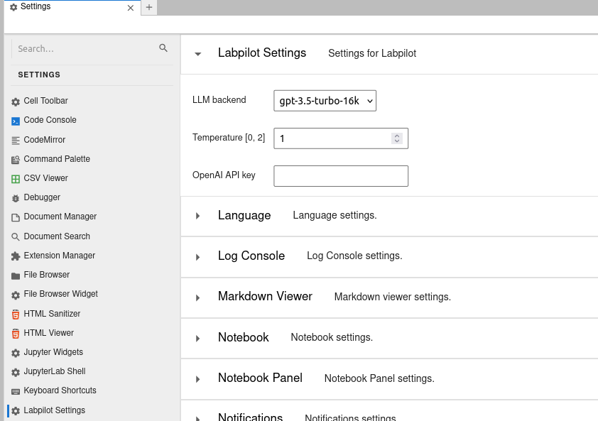
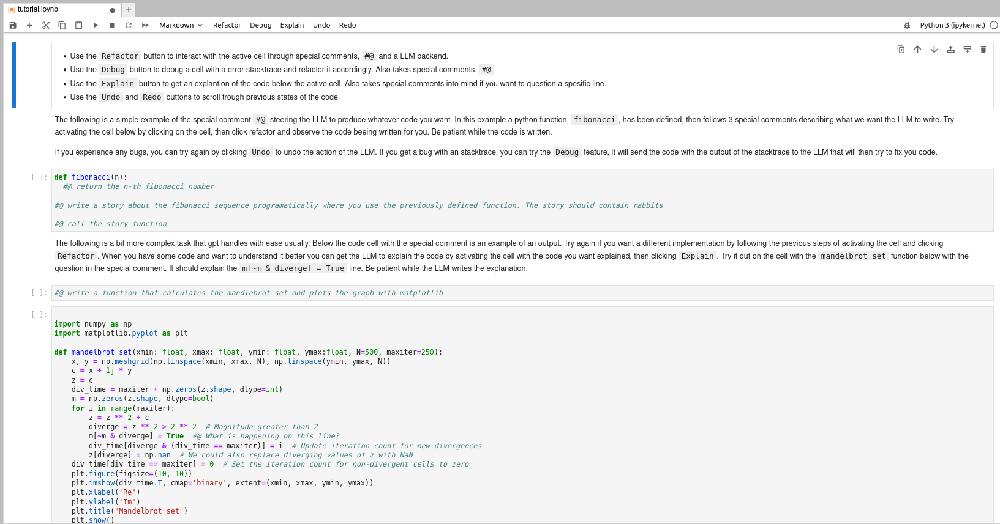

# Labpilot
Copilot for jupyter lab

We are bringing "comment driven development" back in vouge and brushing off its bad reputation!

### Refactor feature:
Use special comments, `#@` to steer the llm to write the code you want.

### Bugs in your code?

### Need an explanation?

### Semi-autogpt feature:
Give the agent a goal, and let it do its magic. (This works best with gpt4)

## How to build and run
Right now the easiest way to use this extension is to build (it takes a while the first time) and run the Dockerfile:

    docker build . --tag='labpilot'
    docker run -d --restart=unless-stopped -p 8888:8888 -p 8080:8080 -p 8081:8081 -e JUPYTER_TOKEN=<TOKEN> --name labpilot labpilot

## How to use labpilot
- When you have started the container, navigate to localhost:8888 and use the `<TOKEN>` you started the container with, to log in.
- Next, navigate to Settings > Advanced Setting Editor > Labpilot Settings - and enter your OpenAI api key (remember to add billing information to OpenAI since labpilot uses the chat completion api, which costs money): 

- After that I would follow the tutorial in the `tutorial.ipynb` file for a short introduction to labpilots features: 